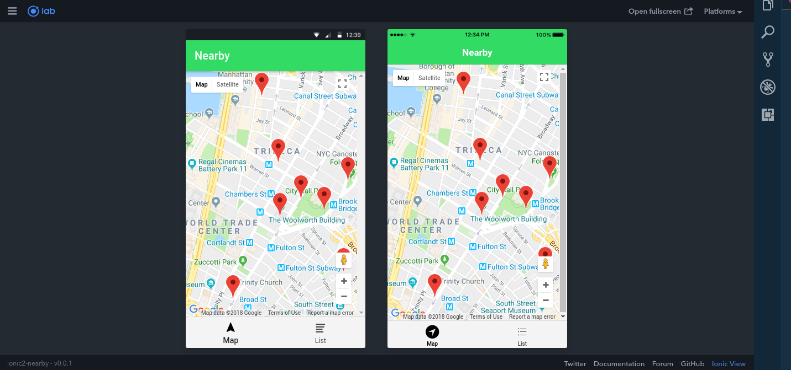
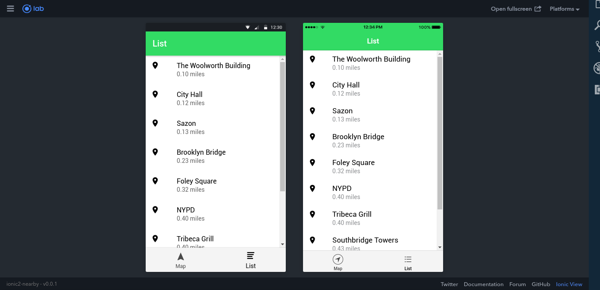

# SCREENSHOTS




---
# HOW TO RUN

- Run:
```bash
npm run ionic:serve
npm run ionic:serve --lab
```

---
# REFERENCES
- https://www.joshmorony.com/create-a-nearby-places-list-with-google-maps-in-ionic-2-part-1/
- https://www.joshmorony.com/create-a-nearby-places-list-with-google-maps-in-ionic-2-part-2/
